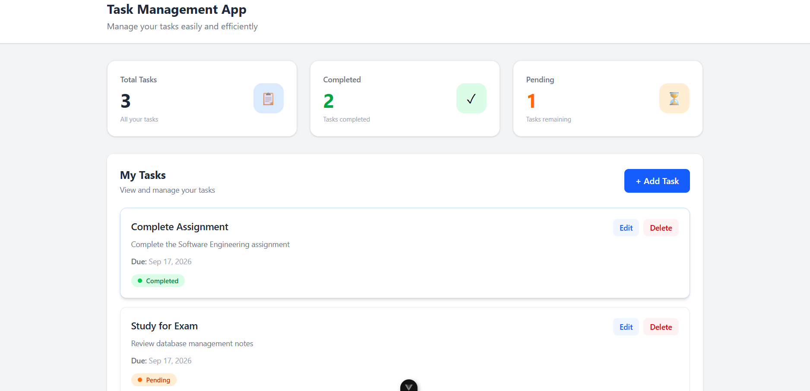
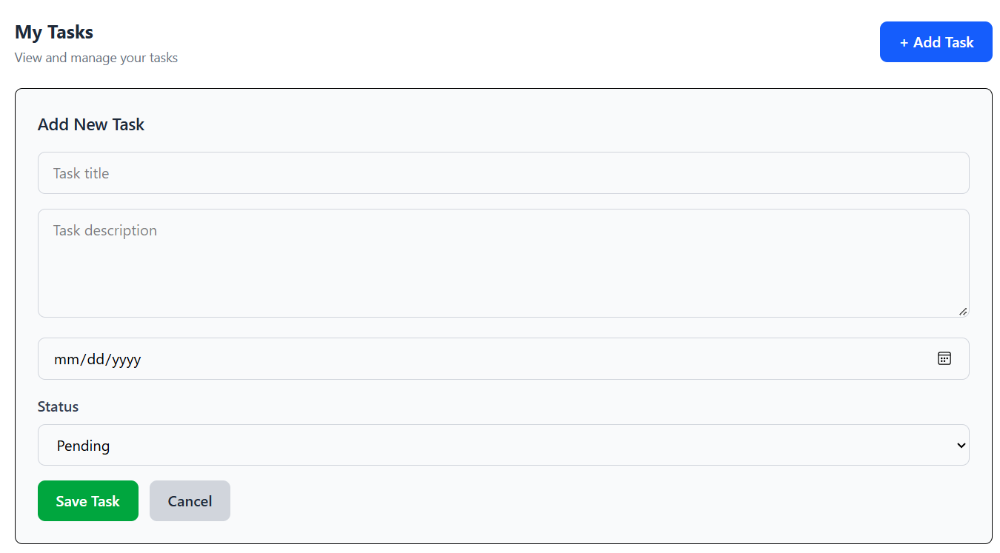
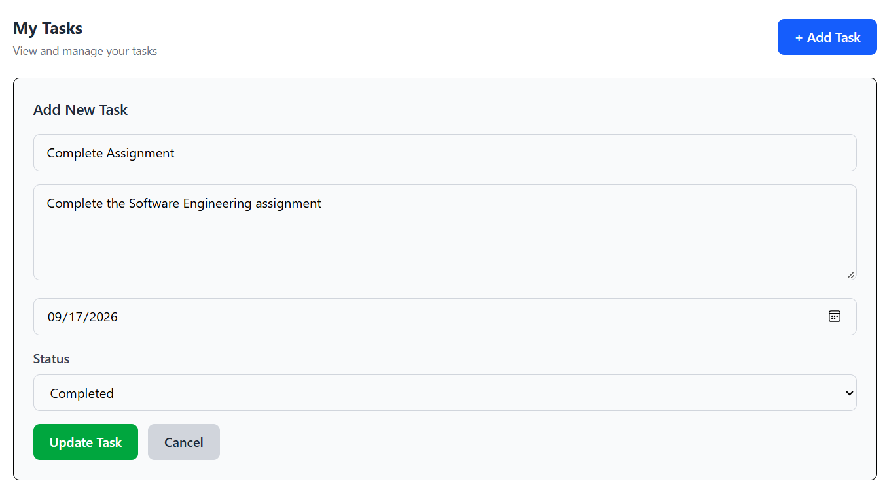
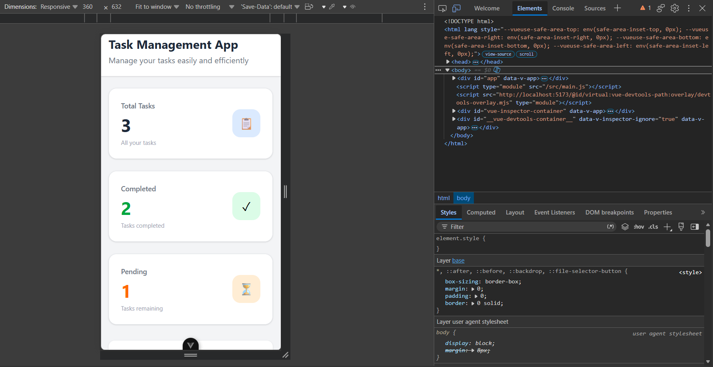

# Task Management App

A full-stack Task Management application built with ASP.NET Core Web API, Vue.js, Tailwind CSS, and SQL Server.

## Features

- Create new tasks
- View all tasks
- Edit existing tasks
- Delete tasks
- Mark tasks as completed
- Set task due dates
- Task dashboard with statistics
- Responsive and mobile-friendly design

## Technologies Used

### Frontend
- Vue.js 3
- Vite
- Tailwind CSS

### Backend
- ASP.NET Core Web API
- Entity Framework Core
- C#

### Database
- Microsoft SQL Server

### Tools
- Visual Studio
- Visual Studio Code
- Postman
- Git & GitHub

## Screenshots

### Dashboard



### Add Task



### Task Card


### Edit Task



### Mobile View



## Project Structure

```text
TaskManagement/
├── TaskManagement.API/
├── task-management-frontend/
├── screenshots/
├── postman/
├── TaskManagement.slnx
└── README.md
