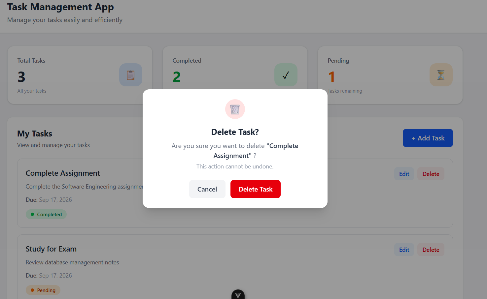

# Task Management App

A full-stack Task Management application that allows users to create, manage, update, and delete tasks through a responsive web interface.

## Overview

This project was developed to practice full-stack web development by connecting a Vue.js frontend with an ASP.NET Core Web API and SQL Server database.

## Features

- Create new tasks
- View all tasks
- Edit existing tasks
- Delete tasks
- Mark tasks as completed
- Set task due dates
- Dashboard with task statistics
- Responsive and mobile-friendly interface
- RESTful API integration
- Data persistence using SQL Server

## Technologies Used

### Frontend

- Vue.js 3
- Vite
- Tailwind CSS

### Backend

- ASP.NET Core Web API
- C#
- Entity Framework Core

### Database

- Microsoft SQL Server

### Development Tools

- Visual Studio
- Visual Studio Code
- Postman
- Git
- GitHub

## Screenshots

### Dashboard


### Add Task


### Delete Confirmation



### Edit Task


### Mobile View


## Project Structure

```text
TaskManagement/
├── TaskManagement.API/
├── task-management-frontend/
├── screenshots/
├── postman/
├── TaskManagement.slnx
└── README.md